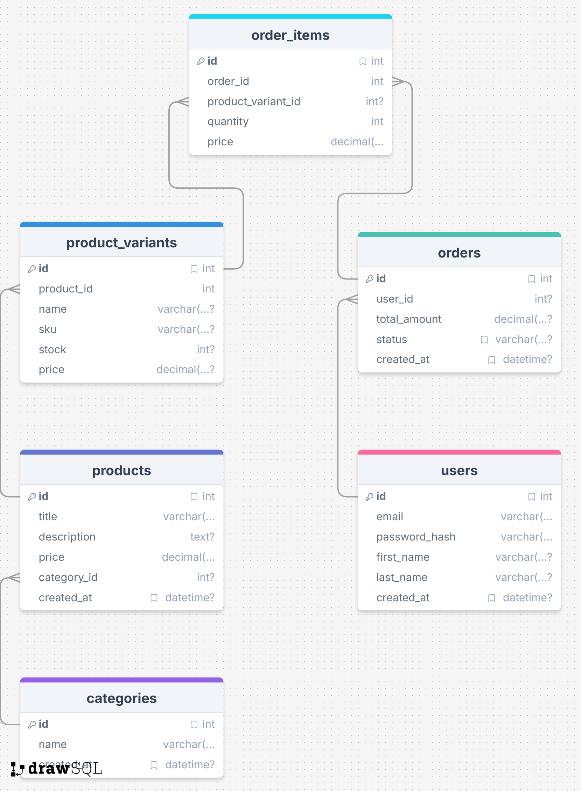

# Natural Language Database Query App

This database models a small e-commerce store. It tracks **users**, **product categories**, **products** and their **variants** (size, color, SKU, stock), **orders**, and the individual **order items** within each order.

## Schema



## Example That Worked

**Question:** Who has spent the most money?

**Generated SQL:**

```sql
[SQL] SELECT u.id AS user_id, u.first_name, u.last_name, SUM(o.total_amount) AS total_spent
FROM users u
JOIN orders o ON u.id = o.user_id
GROUP BY u.id
ORDER BY total_spent DESC
LIMIT 1
```

**Response:**

> The person who has spent the most money is Bob Smith, who has spent a total of $154.97.

## Example That Did Not Work

**Question:** What did people buy last Christmas?

**Generated SQL:**

```sql
[SQL] SELECT p.title, oi.quantity, oi.price FROM order_items oi JOIN orders o ON oi.order_id = o.id JOIN product_variants pv ON oi.product_variant_id = pv.id JOIN products p ON pv.product_id = p.id WHERE o.created_at BETWEEN '2022-12-25 00:00:00' AND '2022-12-25 23:59:59'
```

**Response:**

> The query ran successfully but returned no results — there are no orders in the database from December 24–26, 2024. The seed data only goes back to January 2025.

---

See [examples.md](examples.md) for 6 more worked examples.

## Prompting Strategies

The app supports two strategies for the SQL generation step, switchable via CLI flag:

```bash
node index.js              # few-shot (default)
node index.js --zero-shot  # zero-shot
```

### Zero-shot

The model receives only the schema and the question — no examples. Per Rajkumar et al. (2022), this directly evaluates the LLM's pretrained text-to-SQL capability. It works well for simple single-table queries but occasionally struggles with multi-table joins or ambiguous phrasing.

### Single-domain Few-shot (default)

Three NLQ-SQL example pairs from this same e-commerce database are prepended to the prompt before the user's question. Because the examples come from the same domain and schema, the model can infer patterns like how to join `orders` to `users`, what aliases are preferred, and what output format is expected. This noticeably improved accuracy on complex questions involving multiple joins compared to zero-shot.
